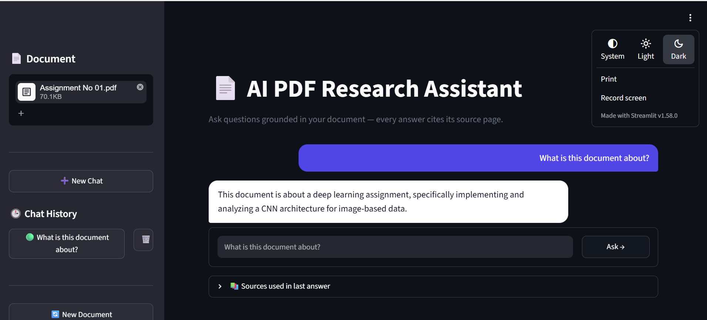

# 📄 AI PDF Research Assistant

An end-to-end **Retrieval-Augmented Generation (RAG)** application that lets you upload a PDF and ask natural-language questions about it — with every answer grounded in the source document and cited by page number.



## 🚀 Live Demo
[Try it here](your-deployed-link-once-you-have-one)

## ✨ Features
- 📤 PDF upload with automatic text extraction and cleaning
- ✂️ Recursive chunking with configurable overlap
- 🧠 Semantic embeddings via `all-MiniLM-L6-v2` (Sentence-Transformers)
- 🔍 Vector similarity search using **FAISS**
- 🤖 Context-grounded answer generation via **Groq (Llama 3.3 70B)**
- 📚 Source citations (page number + similarity score) for every answer
- 💬 Multi-chat interface with persistent chat history
- 🎨 Custom-styled Streamlit UI

## 🏗️ Architecture

ai-pdf-research-assistant/
├── app.py
├── requirements.txt
├── README.md
├── .gitignore
└── screenshots/
    └── demo.png

## 🛠️ Tech Stack
| Component | Tool |
|---|---|
| PDF Parsing | PyMuPDF |
| Embeddings | Sentence-Transformers (MiniLM-L6-v2) |
| Vector Store | FAISS |
| LLM | Groq API (Llama 3.3 70B) |
| Frontend | Streamlit |

## ⚙️ Setup

```bash
git clone https://github.com/khansaurooj/ai-pdf-research-assistant.git
cd ai-pdf-research-assistant
pip install -r requirements.txt
```

Create a `.env` file:

Run the app:
```bash
streamlit run app.py
```

## 📸 Screenshots
See `/screenshots` folder.

## 🎯 What This Project Demonstrates
- End-to-end RAG pipeline design
- Vector search and retrieval tuning
- Prompt engineering to reduce hallucinations
- Practical LLM application development
- Clean UI/UX for AI tools

## 📄 License
MIT
